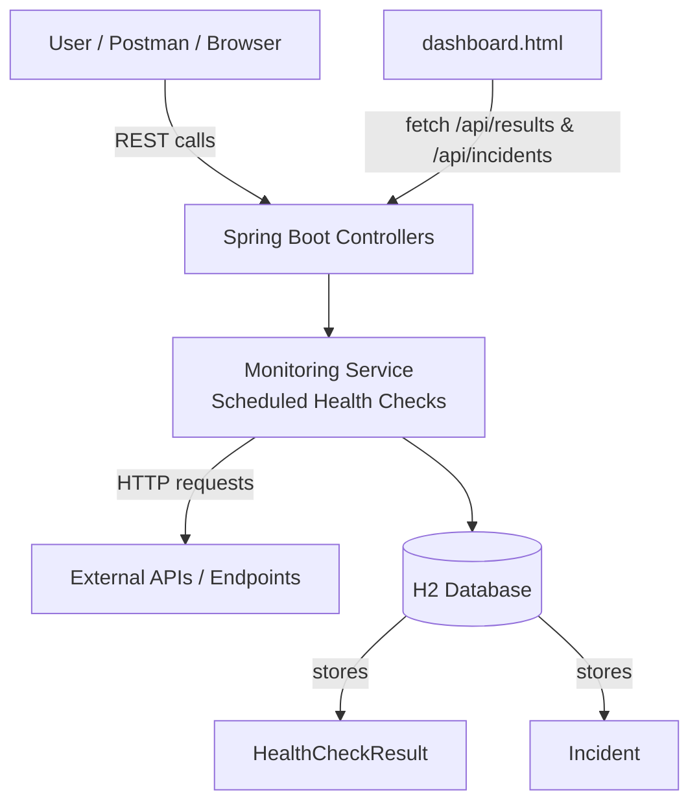

# API Health Monitor (Spring Boot)

Production APIs can fail quietly — and teams often find out only after users report issues.  
**API Health Monitor** is a lightweight monitoring + incident workflow service that checks endpoints on a schedule, captures latency/status, and auto-creates incidents after repeated failures.

---

## What it demonstrates

- Production-style health monitoring & failure detection  
- Incident creation after **3 consecutive failures** (noise-controlled)  
- Manual resolution workflow (**OPEN → RESOLVED**)  
- RESTful API + persistence (**Spring Data JPA + H2**)  
- Simple dashboard UI for quick visibility

---

## Architecture

