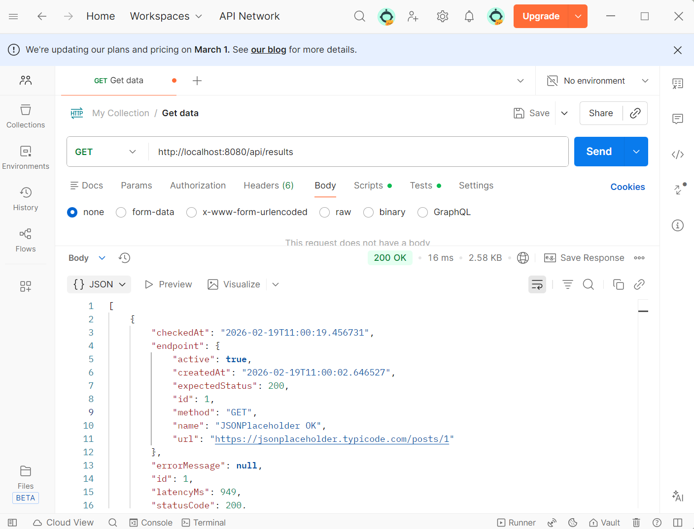
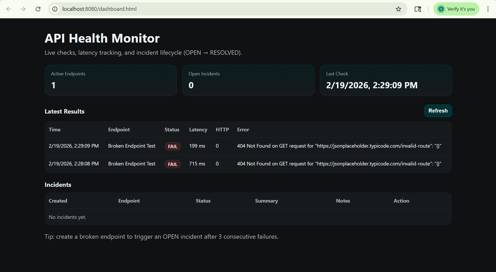
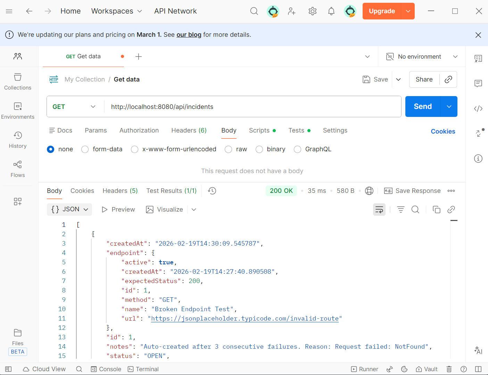
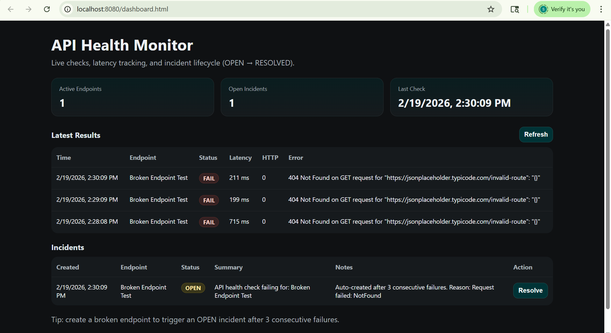
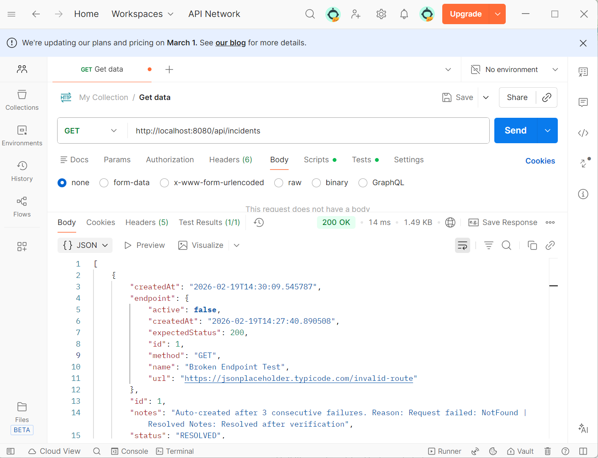
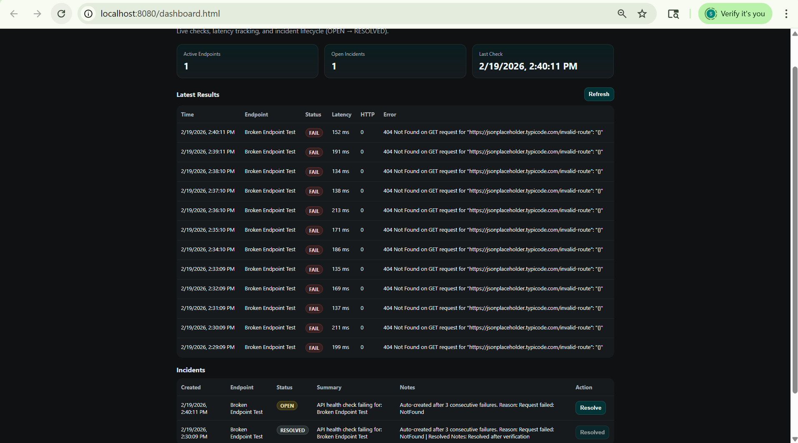

# API Health Monitor

A lightweight Spring Boot application that monitors external APIs, tracks latency, and automatically creates incidents after repeated failures.

---

## Features

- Monitor multiple endpoints (GET support)
- Track response latency and HTTP status
- Automatically create incidents after 3 consecutive failures
- Resolve incidents via REST API
- Simple dashboard view

---

## Architecture

- Spring Boot
- H2 In-Memory Database
- REST Controllers
- JPA Repositories
- Scheduled Health Checks

---

## Demo Flow

### 1. Successful Health Check



System tracks:
- statusCode
- latencyMs
- success flag

---



Failed endpoint detected, logged in the dashboard.

### 2. Automatic Incident Creation





After 3 consecutive failures:
- Incident created automatically
- Status = OPEN

---

### 3. Incident Resolution





PATCH endpoint updates status to RESOLVED.

---

## Project Impact & Benefits

This project demonstrates:

- Production reliability engineering thinking
- Failure detection logic
- Incident lifecycle handling
- API monitoring design
- Backend REST development

---

## How to Run

```bash
./mvnw spring-boot:run (or) .\mvnw.cmd clean spring-boot:run(recommended)
